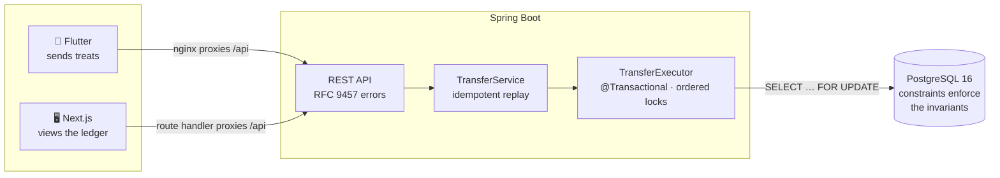

# 🐾 MeowPay

A thin vertical slice of a treat ledger: one cat sends treats to another, across a Kotlin/Spring
backend, a Next.js ledger, and a Flutter mobile app — with the money-movement path built to survive
concurrency rather than merely to work.

---

## Quickstart

```bash
docker compose up --build
```

That is the whole setup. Postgres starts, Flyway migrates and seeds three cats, and both clients wait
for the backend to report healthy before they come up.

| | URL | What it is |
|---|---|---|
| **Web ledger** | http://localhost:3000 | Every transfer, live |
| **Mobile app** | http://localhost:8081 | The Flutter app, compiled to web |
| **API** | http://localhost:8080 | Spring Boot |
| **Health** | http://localhost:8080/actuator/health | Includes the datasource |

**Try the loop:** open both. Send treats at `:8081`, and watch them appear at `:3000` within a second,
with balances moving and the total in circulation staying constant.

Seeded: **Whiskers 1000**, **Mittens 500**, **Luna 250**.

<details>
<summary>Running natively, without Docker</summary>

Requires JDK 21, Node 20+, Flutter 3.5+.

```bash
docker compose up -d postgres          # database only
cd backend  && ./gradlew bootRun       # :8080
cd frontend && npm install && npm run dev   # :3000
cd mobile   && flutter run                  # simulator or device
```

The Flutter app defaults to `http://localhost:8080`. An Android emulator needs the host's alias:

```bash
flutter run --dart-define=API_BASE_URL=http://10.0.2.2:8080
```

> **Note:** if you already run Postgres locally on 5432, it will shadow the container on loopback and
> the backend will connect to the wrong database. Stop it, or change the published port in
> `docker-compose.yml`.
</details>

---

## AI-assisted engineering

Claude Code did most of the typing. The judgement calls, and the bugs it missed, are below.

### The loop

| Step | What it meant here |
|---|---|
| **Design** | Schema, locking strategy and idempotency flow agreed in a document *before* any code. Five open questions answered explicitly. |
| **Test first** | On the ledger core, the concurrency suite was written and failing before `TransferService` existed. |
| **Verify by breaking** | Every correctness claim was checked by deleting the mechanism and confirming the suite goes red. |
| **Ship in slices** | One phase, one PR, CI green. 11 PRs, no direct commits to `main` once protection was on. |

### The process is in the repo

```
.claude/
├── agents/   code-reviewer · fintech-reviewer · security-reviewer
│             test-engineer · architecture-reviewer
└── skills/   verify-slice · ledger-audit · review-gate · open-pr
              commit-message · database-review · api-design
```

They encode *this* codebase's failure modes — the `25P02` recovery trap, Spring self-invocation,
lock-ordering collisions, tests that cannot observe the race they name. Not generic checklists. Each
is told that an empty report on clean code is the right answer, because a reviewer that always finds
something is one nobody trusts.

### Where the agent was wrong

The useful half. Every one of these passed lint, types and a green build.

| It produced | Actually true | Caught by |
|---|---|---|
| A `rewrites()` API proxy, commented as runtime-configurable | `rewrites()` is evaluated at **build** time — every containerised request returned **500** | Running the Docker stack, not the dev server |
| Cat colours hashed from names | `Whiskers` and `Mittens` collided on the same colour | Looking at the rendered UI |
| Pre-commit hook using the ambient JVM | Picked up Java 26; Gradle 8.10 failed with a bare `26.0.2.1` | Committing from a clean shell |
| `depends_on: [backend]` for both clients | Waits for the container to *exist*, not to be *ready* — first page load failed mid-migration | `docker compose down -v` then a cold start |
| `@Max` on a query param | Raises a different exception than body validation; `?limit=9999` returned **500**, not 400 | Testing over HTTP, not through the service |

The pattern: **none were visible in the code, all were visible in the running system.**

### By the numbers

| | |
|---|---|
| Pull requests | 11, each with CI green |
| Tests | 34 — 21 backend on real Postgres, 13 Flutter |
| Direct commits to `main` | 0 after branch protection |
| Correctness claims verified by deletion | 3 |

> **Not claimed:** a full adversarial review pass across the finished codebase was cut for time. The
> five agents are checked in and runnable via `/review-gate`; the `database-review` and `api-design`
> checklists were applied during their phases. This section does not claim an audit that did not run.

---

## Architecture



Both clients reach the API through their own server, never cross-origin. That keeps the backend free
of a CORS policy that exists only for a browser's convenience, and keeps the API's location out of the
client bundle.

### Stack, and why

| Layer | Choice | Reason |
|---|---|---|
| Backend | **Kotlin + Spring Boot 3 + JPA** | Matches the stack this is written for. Pessimistic locking and transaction boundaries are first-class rather than bolted on. |
| Database | **PostgreSQL 16 + Flyway** | Row-level locking is the mechanism the whole design rests on. Flyway owns the schema; Hibernate is demoted to `validate`, so a drifted mapping fails at boot. |
| Web | **Next.js + Tailwind** | Reading the ledger is a server-rendered page with a poll. No client state library earns its place here. |
| Mobile | **Flutter** | The sender is the mobile surface. Idempotency keys are generated per intent on the client. |

---

## Financial correctness

This is the part worth reading closely. Four mechanisms, each covering what the others cannot.

### 1. Money is an integer

`bigint` in Postgres, `Long` in Kotlin. One treat is one unit; there are no fractional treats and
therefore no rounding policy to get wrong. The type rules out a class of bug rather than guarding
against it.

### 2. Locks are acquired in a total order

Both wallets are read with `SELECT … FOR UPDATE`, **sorted by wallet id** — not sender-then-recipient.

Sender-first deadlocks the moment `A→B` races `B→A`: each transaction holds the row the other needs.
A global ordering makes a wait-for cycle impossible to construct.

The comparator only has to be total and applied identically *within this application*. It does **not**
need to agree with Postgres's `uuid` collation, which compares bytes unsigned while Java compares two
signed longs. Internal consistency is the entire requirement, so the sort lives in one place.

> Verified by deletion: with the sort removed, 60 concurrent bidirectional transfers produced
> **55 failures and 220 deadlocks**. With it, **60/60 succeeded, zero deadlocks.**

### 3. Idempotency is settled by the database

The `UNIQUE` index on `idempotency_key` is the arbiter. **No application-level check can be
race-free**: two concurrent requests carrying the same key both pass a pre-flight `SELECT` and both
proceed. The index is what forces one to lose.

The recovery is where this usually goes wrong, and it is split across two beans deliberately:

- Postgres **aborts the entire transaction** on any statement error, so the winning row cannot be read
  on that connection — every statement there fails with `25P02`. The read-back must happen *after*
  rollback, in a new transaction.
- Spring applies `@Transactional` **through a proxy**, so had both halves lived in one class the
  recovery would have run inside the aborted transaction — reproducing exactly the bug it exists to
  avoid, and only under concurrency.

`TransferService` is therefore *not* `@Transactional`; it reacts to a transaction that already rolled
back. A `request_fingerprint` (SHA-256 over sender, recipient, amount) separates a genuine retry from
a client reusing one key for different money — the latter is a `409`, not a silent replay of someone
else's transfer.

**Honest limitation:** a *failed* attempt rolls back and releases the key, so the endpoint is
idempotent for **successful** transfers. Persisting failed attempts needs a separate transaction and
is out of scope.

### 4. The database enforces the invariants regardless

```sql
CHECK (balance >= 0)                    -- a negative balance is unrepresentable
CHECK (amount > 0)
CHECK (sender_wallet_id <> recipient_wallet_id)
UNIQUE (idempotency_key)
```

Application checks produce the friendly `422`. These constraints are what stay true when some future
code path, script, or migration bypasses the service.

### On the client

The Flutter app generates one idempotency key **per user intent** and holds it across retries. If a
send times out, the server may well have committed it — what went missing is the *response*, not
necessarily the money. Retrying with the same key lets the server replay the original instead of
moving treats twice. The key is retired on success and on a business rejection (final, nothing moved),
but **kept** on a network failure (outcome unknown).

---

## Testing

**34 tests: 21 backend, 13 Flutter.**

Backend integration tests run against a real **PostgreSQL 16 via Testcontainers** — the same image
`docker-compose` uses. Locking bugs are invisible to a mocked repository; an in-memory fake would pass
every test below while the real system lost money.

| Test | What it proves |
|---|---|
| 10 concurrent × 80 treats from a balance of 100 | exactly 1 succeeds, 9 refused, balance 20 |
| 20 concurrent requests sharing one key | 1 created + 19 replayed, **one** debit |
| 20 concurrent bidirectional transfers | zero deadlocks |
| 30 chaotic transfers across 3 wallets | `SUM(balance)` unchanged, nothing negative |
| Raw `UPDATE … balance = -1` | the `CHECK` constraint refuses it outside the service |

Two settings stop the suite passing for the wrong reason, and both are the difference between a test
and a decoration:

- **No `@Transactional` on the test base class.** It would pin one connection and roll back at the end,
  so spawned threads could not see the fixture — the concurrency tests would pass regardless of the
  locking.
- **Hikari pool sized above the thread count.** With a smaller pool, threads queue for *connections*
  rather than *row locks*, and the race never happens.

### The suite was verified by breaking the code

| Change | Result |
|---|---|
| Removed lock ordering | ❌ bidirectional contention test failed |
| Replaced `FOR UPDATE` with a plain read | ❌ double-spend **and** conservation tests failed |
| Both restored | ✅ all pass |

---

## Trade-offs, and what was skipped

| Skipped | Why |
|---|---|
| **Auth** | The exercise is the transfer loop. The active cat is chosen in the UI. Every endpoint would need authorization before this is real. |
| **Double-entry ledger** | Its payoff is multi-leg movements — fees, FX, settlement. This system has one leg type. `Transfer` becomes a header with two `Posting`s when that changes; no API break. |
| **WebSockets** | A socket adds a connection lifecycle and delivery guarantees to a read-only view where a second of staleness costs nothing. Polling, with in-flight requests aborted so a slow response cannot overwrite a newer one. |
| **Top-up flow** | Deliberately out of scope — funding arrives via payment webhook in production. Seeded balances instead. |
| **Rate limiting** | An unauthenticated money endpoint would need it in production. Noted rather than silently omitted. |
| **`MockMvc` / Playwright / Flutter integration tests** | The HTTP contract and both UIs were verified by hand against a live stack. A query-param validation bug that returned `500` instead of `400` is exactly what a controller test would have caught — the gap is real. |
| **Interactive Flutter send verification** | Synthetic events do not reach Flutter's CanvasKit surface, and the native simulator needs a full Xcode install. The send path is covered by tests against a fake transport; nobody has tapped the button and watched treats move. |
| **Analytics, observability, multi-currency** | No logging or tracing beyond Spring's defaults. Out of scope for a slice about ledger integrity. |

---

## Repository layout

```
backend/    Kotlin · Spring Boot 3 · JPA · Flyway     the ledger
frontend/   Next.js · React · Tailwind                the ledger viewer
mobile/     Flutter                                   the treat sender
.claude/    agents + skills                           the engineering process
.github/    CI — the same four gates run locally
```

Every PR runs backend tests (with Testcontainers), the web build, Flutter analyze and test, and a
compose config check. `main` is protected: PRs only, all four checks required.
